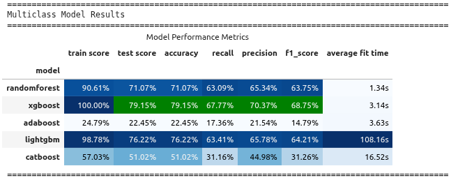
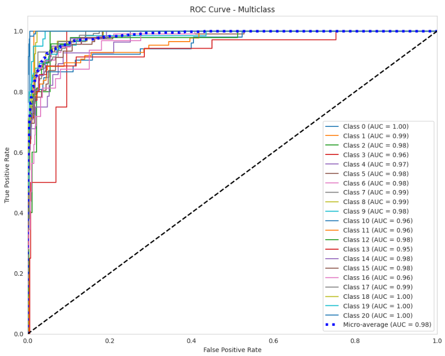
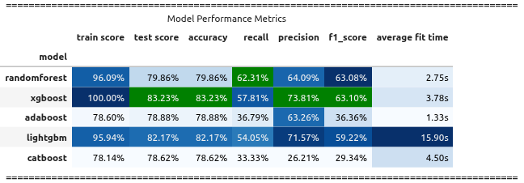
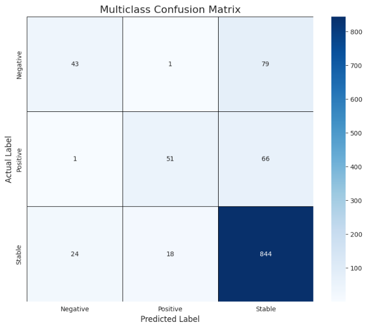
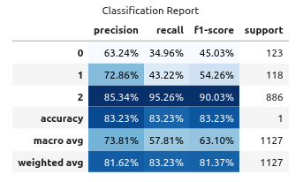

# Countries_Ratings

**Countries Credit Ratings Predictor Tool**

**Author:** Iulian Costea

#### 📅 Last Updated

---

## 📌 Executive Summary

   
The **Countries Ratings** project is designed to predict **Country Credit Ratings** and **Country Outlook** for the **current year** and the **next year** for **any country worldwide**.

This information is critical for **companies**, **institutional investors**, and **individual investors** seeking new investment opportunities and assessing different countries' investment attractiveness and associated risk levels.

Predictions follow the rating scales provided by agencies like **Moody’s**, **Fitch**, and **S&P**. Historical credit rating data from **S&P**, **Moody’s**, and **DBRS** has been used for model training. Additional macroeconomic and demographic data has been collected from **World Bank** and **IMF**.

---

## 🎯 Rationale

- Not all countries have official credit ratings, and this is an issue for investors that want to invest is countries that do not have credit ratings.
- Even when available, ratings are often updated infrequently. This is because credit ratings agencies release the updates based on a particular schedule wich is not always frequent enough.
- This tool provides **timely predictions** of ratings and outlooks for **current and near-future years**.

This makes the tool valuable for investors who require **up-to-date insights** into a country’s investment profile.

---

## ❓ Research Question
Can we predict a country’s **Credit Rating** and its **Country Outlook** for the **current** and **next year** using macroeconomic and demographic indicators?

---

## 📊 Data Sources
| Dataset                        | Source                                                                 |
|--------------------------------|------------------------------------------------------------------------|
| Countries Credit Ratings       | [Wikipedia](https://en.wikipedia.org/wiki/List_of_countries_by_credit_rating) |
| CPI (Inflation)                | [IMF](https://www.imf.org/en/Publications/WEO/weo-database/2025/april) |
| Government Debt                | [IMF](https://www.imf.org/en/Publications/WEO/weo-database/2025/april) |
| Macroeconomic Indicators       | [World Bank](https://databank.worldbank.org/source/world-development-indicators) |

- Initial data period coverage: **1960–2023**
- Training period after cleaning data: **1980–2023**

---

## 🛠️ Methodology

1. **Data Preparation**
   - Extract, aggregate, normalize historical country ratings.
   - Map ratings to numerical values (**ratingn**) to ensure proper normalization of the credit ratings labels.
   - Consolidate outlook label to clean the outlook multiclass 
   - Transform and merge all different datasets to bring together macroeconomic and demographic data.
   - Clean consolidated DataFrame.

2. **Feature Engineering**
   - Correlation analysis + removal of multicollinear features.
   - Target imputation (`ffill`, `bfill`).
   - Feature imputation with multiple strategies: `polynomial_fill`, `mean_fill`, `rolling_average`, `ARIMA`, `global fallback`.
   - PCA for dimensionality reduction (first principal components).
   - Creation of lagging features *(work in progress).*

3. **Modeling**

      **Regression Models**
      - Baseline: *Work in progess*
      - Hyperparameter optimization: *Work in progess*
      - Tested models: *Work in progess*
      - Evaluations: *Work in progess*
     
      **Classification Models**
      - Classification models predicted two targets Country Credit Rating - **ratingn** and Country Outlook - **outlook**
      - Although "year" is a numerical category in the pre-processing phase was modeled as a categorical category
      - I've removed *Country category* from the training Dataset to prevent country bias and develop a global prediction models
      - Baseline: **DecisionTreeClassifier** for multiclass classification for two targets **ratingn** and **outlook**.
      - Hyperparameter optimization using **RandomizedSearchCV**.
      - Tested models: **RandomForest**, **XGBoost**, **LightGBM**, **CatBoost**.
      - Evaluations with **Confusion Matrix**, **AUC/ROC Curves**.
      - As key evaluation metrics I've used **F1-Score** for overall model evaluation and **Precision** and **Recall** for each class performance evaluation  

---

## 📈 Results

### Overall Technical Findings
- Feature imputation strategies improved data coverage significantly and allowed for a broader model usage (both numerical and categorical models).
- Multi-colinearity analysis and removal technique helped to remove many features and optimize the working dataframe size.
- PCA further reduced dimensionality without major performance losses (95%).

### Challenges
- **Imputation techniques** is a real challenge due to the nature of data and overall data sparcity
- **Class imbalance** in *outlook* prediction remains a key challenge.

### Baseline results
| Baseline results                              | F1-Score |
|-----------------------------------------------|----------|
| Country Credit Ratings (yr) - DecissionTree   |   0.5469 |
| Country Outlook (yo) - DecissionTree          |   0.5588 |

### Country Credit Rating results

 

  

 

 

  

 

 

  

 

 

  

 

 

  

 

### Country Outlook results
 

  

 

 

  

 

 

  

 

 

  

 

 

  

 

---

## 🚀 Next Steps

- [ ] Address class imbalance in *outlook* and *ratingn* predictions (e.g., SMOTE, class weights).
- [ ] Create lagging features for *outlook* and **ratingn** targets
- [ ] Improve imputation techniques.
- [ ] Finalize regression models for feature predictions (current + next year).
- [ ] Add interpretability layer (e.g., SHAP values).

---

## 📂 Project Outline
- [Notebook: Countries Ratings](Countries_ratings.ipynb)

---

## 📜 License
MIT License

---

## 📝 Notes
This README is a work in progress. Future updates will include detailed evaluation metrics, methodology diagrams, and reproducibility instructions (environment setup, run commands).

